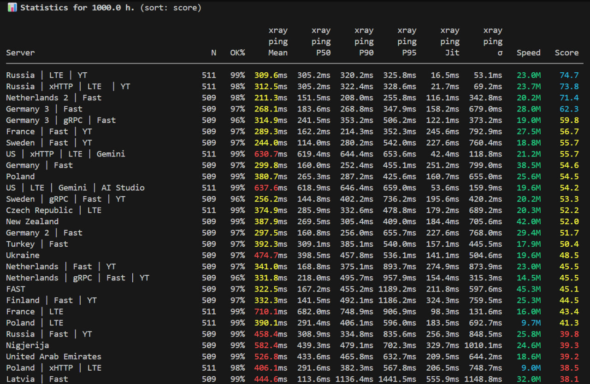

# VPN Latency Monitor

A specialized Python tool to monitor, test, and analyze VPN subscription servers (VLESS, VMESS, Trojan, Shadowsocks, Hysteria2, etc.) for latency, speed, and jitter characteristics.

# Disclaimer

This was my little weekend project to test my personal VPN subscription servers and compare them. The code is almost exclusevly written by Opus 4.6, Gemini 3.1. I have debugged it and it works really good for my key but I haven't tested it properly in different settings so there migh be some bugs. To make the repository easier to use I made the commands flexible, documented, well-structured and unified.

## Results Examples




## 📖 Documentation

For detailed guides, please refer to:
- [**Command Reference**](docs/commands.md) — Detailed flags for `fetch`, `test`, `stats`, `graph`, etc.
- [**Metrics & Scoring**](docs/metrics.md) — How Jitter, Stability Score, and Percentiles are calculated.
- [**Architecture**](docs/architecture.md) — Source code structure, DB schema, and Xray-core integration.

## 🛠️ Installation

```bash
# Clone the repository
git clone https://github.com/K0tovskiy/VPN-servers-bench
cd VPN-servers-bench

# Install optional dependencies for graphing
pip install -r requirements.txt
```
## Note: This repository requires Xray to be installed. You can use this command:
```bash
bash -c "$(curl -L https://github.com/XTLS/Xray-install/raw/main/install-release.sh)" @ install
```

## 🚀 Quick Usage Example

```bash
# Add a new subscription
python3 run.py fetch "https://example.com/sub"

# Test specific servers by ID, Name, or URL (tasks: xray-ping, tcp-ping, speed)
python3 run.py test --tasks xray-ping --servers "1,Italy,https://..."

# Run 24h statistics sorted by stability score
python3 run.py stats --hours 24 --sort "score"

# Generate a PNG graph for a specific node for the last 12 hours
python3 run.py graph "MyServer" --hours 12

# Export raw data to CSV for external analysis
python3 run.py export --timespan "2026-03-01..2026-03-07" > report.csv
```

---

## 🏗️ Project Structure

- `run.py`: Primary CLI entry point.
- `src/vpn_monitor/`: Modular core implementation.
- `docs/`: In-depth documentation.

---
